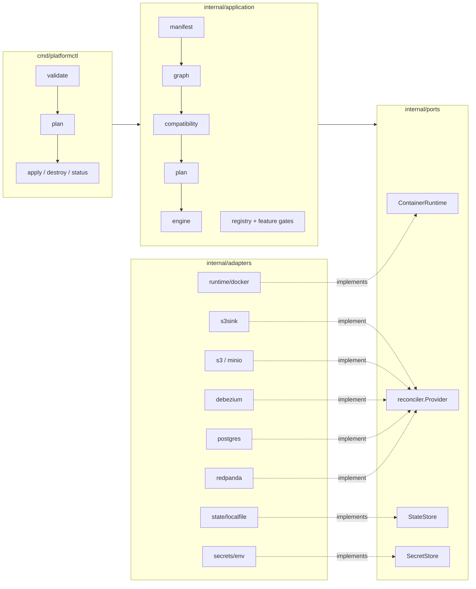

<div align="center">

# 🌐 Datascape

### `platformctl` — declarative data infrastructure on container runtimes

*Describe your data platform as resources. Plan the diff. Apply it. Watch a
Postgres → Debezium → Redpanda → S3 pipeline reach `Ready` from a directory
of YAML.*

[](https://github.com/rezarajan/platformctl/actions/workflows/ci.yml)
[](go.mod)
[](#architecture)
[](docs/planning/05-v1-first-version-spec.md)

</div>

---

Datascape treats the *infrastructure of a data platform* — databases, event
streams, CDC connectors, object storage, sinks — the way Kubernetes treats
workloads and Terraform treats cloud resources: a **typed resource model**,
a **deterministic plan**, an **idempotent reconciliation engine**, and
**drift-aware status**, all from one static binary.

```console
$ platformctl apply ./platform/ --auto-approve
ok   Provider/local-redpanda        (create) in 2.7s
ok   EventStream/attendance-events  (create) in 213ms
ok   Provider/local-postgres        (create) in 2.7s
ok   Provider/postgres-cdc          (create) in 6.7s
ok   Source/student-database        (create) in 53ms
ok   Binding/student-db-to-events   (create) in 254ms   # Debezium connector: RUNNING
...
applied: 14 succeeded, 0 failed, 0 skipped
```

## ✨ Highlights

- **Declarative, diff-driven** — `plan` is computed purely from manifests +
  recorded state (never live probing), so it is deterministic and
  reviewable; `apply` reconciles in dependency order and re-applying an
  unchanged set makes **zero mutating calls**.
- **A real pipeline, end-to-end** — the provider set covers a working
  lakehouse: Redpanda, Postgres, MySQL/MariaDB, Debezium CDC, MinIO/S3, a
  Kafka-Connect S3 sink, Nessie (Iceberg REST catalog), Marquez
  (OpenLineage backend), and a proxy surface giving external systems stable
  platform-owned entrypoints. Rows inserted into Postgres land as objects
  in a bucket with nothing hand-wired in between.
- **Orchestrator-ready** — `examples/lakehouse/` stands up the
  infrastructure a Dagster deployment runs against: object store, an
  Iceberg `Catalog`, a lineage backend, relational stores, and a managed
  `Connection` giving an external database a stable platform-owned
  entrypoint (with CDC flowing through it) — every endpoint your
  orchestrator connects to, documented.
- **Provider-agnostic resource model** — the manifests speak nouns
  (`Catalog`, `Connection`, `Source`, `EventStream`, `Dataset`);
  technologies (Nessie, socat, Postgres, Redpanda) are engines *realizing*
  them, capability-checked at `validate`.
- **Capability-checked bindings** — a `Binding(mode: cdc)` against a
  provider that can't do CDC, or a `sink` to a format the connector can't
  write, fails at `validate` with a precise error — not at 2 a.m. during
  `apply`.
- **Safety in the engine, not in conventions** — external resources are
  never destroyed without explicit, separate opt-in flags; failed destroys
  block teardown of their dependencies; unmanaged Docker objects are never
  touched (everything Datascape owns is labeled).
- **Built for out-of-band failure** — `drift` probes live infrastructure
  and records what it finds; `apply` heals drifted resources (a killed
  container is recreated, a stopped one restarted, a failed connector
  restarted) while `plan` stays deterministic and never mutates; `destroy`
  converges even when half the platform is already dead. All of it enforced
  by a chaos-monkey integration suite in CI.
- **Secrets stay out of manifests** — `SecretReference` resources resolve
  through pluggable backends (`env`, `file`, and gated `vault`); specs carry
  names, never values, and the schemas make a plaintext value unrepresentable.
- **Lineage-aware by design** — `metadata.observers` forwards a resolved
  `LineageEndpoint` to providers that consume one (Debezium's native
  OpenLineage integration), and degrades to an informational condition when
  they don't.
- **Feature-gated evolution** — every provider ships behind a gate
  (`--feature-gates=Name=true|false`), so `main` is always releasable.

## 🏗 Architecture

Strict hexagonal layering — the entire design hangs on one invariant:
**domain and ports never import an adapter.**



| Layer | Rule |
|---|---|
| `internal/domain` | Imports nothing else in this repo. Resource kinds, graph, lineage types. |
| `internal/ports` | Interfaces only (+ conformance suites). Imports `domain`. |
| `internal/adapters` | Implement ports; may import third-party SDKs. Every adapter passes its port's conformance suite. |
| `cmd/platformctl`, `application/registry` | The **only** places allowed to import concrete adapters. |

### The resource model

Eight kinds, one worked scenario:

```
Source(postgres) ──Binding(mode: cdc)──▶ EventStream ──Binding(mode: sink)──▶ Dataset(bucket/prefix)
      │                    │                  │                  │                    │
  Provider(postgres)  Provider(debezium)  Provider(redpanda)  Provider(s3sink)   Provider(minio)
                                                                          SecretReference(env) ⤴

Catalog(engine: nessie)      # a table catalog as a noun — engines realize it
Connection(port, target)     # a stable entrypoint to a system that lives elsewhere;
                             # external resources integrate through it (address here,
                             # credentials in the SecretReference its secretRef names)
```

`Binding` is the connective tissue: a directed edge whose `mode` names the
movement mechanism, admitting a *set* of Kind pairings (`cdc`:
Source→EventStream; `sink`: EventStream→Dataset or EventStream→Source —
databases are legitimate sinks; `ingest`: Dataset→EventStream — object
stores are legitimate sources). The referenced provider must declare the
capability interface matching the pairing — all enforced at `validate`.
Asset kinds are role-neutral; direction lives in the Binding
(docs/adr/001-bindings-are-directed-edges.md).

## 🚀 Quickstart

**Prerequisites:** Go 1.22+, a running Docker daemon.

```sh
git clone https://github.com/rezarajan/platformctl && cd platformctl
just build        # → bin/platformctl
```

Scaffold a platform instead of hand-writing one — `init` writes a manifest
set that already validates as-is, a `.env` template naming every secret key
it needs, and a README:

```sh
bin/platformctl init cdc-to-lake         # postgres → debezium → redpanda → s3sink → minio
bin/platformctl validate cdc-to-lake     # green immediately, no edits
```

`init --list` enumerates every shipped blueprint (`-o json|yaml` for the
machine-readable form); `cdc-to-lake`, `lakehouse` (adds a Nessie catalog,
Marquez lineage, and an externally-hosted CDC source), `stream-basics`
(just a broker and topics), and `external-cdc` (a Connection-fronted
external database) cover the common starting shapes. Fill in `.env`, then:

```sh
# one-time: the sink Connect image (stock images ship no S3 sink plugin)
docker build -t datascape-s3sink-connect:local cdc-to-lake/s3sink-image/

bin/platformctl apply  cdc-to-lake --env-file cdc-to-lake/.env --auto-approve
bin/platformctl status cdc-to-lake
```

Any secret left unset in `.env` is named explicitly by `apply`'s Preflight
check before anything is touched — never an opaque mid-apply failure.
Insert a row, watch it land in the lake (`platformctl inventory
cdc-to-lake` shows the auto-assigned host ports and which `SecretReference`
holds each credential):

```sh
psql postgres://admin:<db-admin-password>@localhost:<db-port>/appdb \
  -c "CREATE TABLE records (id serial PRIMARY KEY, payload text);
      INSERT INTO records (payload) VALUES ('alice'), ('bob');"

mc alias set local http://localhost:<lake-port> <lake-user> <lake-password>
mc ls --recursive local/raw-events/       # objects appear within ~30s
```

Only tables declared on the CDC Binding (`options.tables`) are captured —
add a table there and re-apply to widen the stream; the connector is
reconfigured in place. See the
[cdc-to-lake blueprint's README](internal/application/blueprint/templates/cdc-to-lake/README.md)
(written alongside the manifests by `init`) for the full walkthrough, or
[examples/cdc-attendance/README.md](examples/cdc-attendance/README.md) for
the hand-written, fixed-port version of the same pipeline this blueprint is
derived from.

Tear it all down (reverse dependency order, labeled objects only):

```sh
bin/platformctl destroy cdc-to-lake --auto-approve
```

## 🖥 CLI surface

| Command | What it does |
|---|---|
| `init <blueprint> [--dir]` | Scaffold a ready-to-apply manifest set + `.env` template + README from an embedded blueprint (`cdc-to-lake`, `lakehouse`, `stream-basics`, `external-cdc`). `--list` enumerates blueprints (`-o json\|yaml` for the machine-readable form). |
| `validate <dir>` | Schema + graph (cycles) + Binding capability checks. No state, no runtime calls. |
| `plan <dir>` | Deterministic diff of manifests vs. state. Exit `1` when changes are pending. |
| `apply <dir>` | Reconcile in topological order; state persisted after every resource. |
| `status <dir>` | Per-resource `Ready`/`DRIFT`/conditions/lifecycle from recorded state. |
| `drift <dir>` | Probe live infrastructure, record observed conditions into state, report drift. Exit `1` when drift is found; run `apply` to heal it. |
| `graph <dir> [--format tree\|dot\|mermaid\|json]` | Render the platform architecture — data-flow pipelines + technology layer, not the raw dependency DAG. `-o json\|yaml` overrides `--format` with a structured node/edge document. |
| `inventory <dir>` (aka `services`, `endpoints`) | List applied components' endpoints + which SecretReference holds their credentials. `--for spark\|trino\|dbt\|psql\|s3\|kafka` renders a paste-ready config snippet from the recorded endpoints instead. |
| `import <Kind>/<name> --from <name>` | Adopt a pre-existing backing object into state as Imported (probe, never create). Gated by `ImportedResources`. |
| `docs build\|serve` | Generate/serve the resource reference from `schemas/`. |
| `destroy <dir>` | Reverse-order teardown. `--include-external` additionally requires `--yes-i-understand-this-is-destructive`. |
| `gc plan [--runtime docker\|kubernetes]` | List every labeled container/network/volume that no state entry accounts for (read-only). |
| `gc apply [--runtime docker\|kubernetes] --yes-i-understand-this-is-destructive` | Remove exactly the objects `gc plan` lists. |
| `state inspect` | Dump the normalized state file (read-only). |
| `state doctor [--runtime docker\|kubernetes]` | Report state defects: stale on-disk format, legacy orphan entries, corrupt key/manifest mismatches, Provider entries whose backing container is gone. Exit `1` when any check finds something. |
| `state repair [--runtime docker\|kubernetes] [--yes]` | Apply doctor's safe fixes: persist a migrated format, drop entries for confirmed-gone Provider objects. No-op on healthy state. |
| `state unlock` | Force-release the state lock (escape hatch for a holder process that died). |

Global flags: `--state-file` (default `.datascape/state.json`, local backend),
`--feature-gates`, `-o table|json|yaml`. Shared state
(`docs/adr/003-shared-state.md`, gated `SharedStateBackend`):
`--state-backend s3 --state-bucket ... --state-endpoint ... --state-secret-ref
...` points every command at an S3-compatible bucket instead of a local file,
with a lease-based lock so two operators can't corrupt each other's apply.

## ☸️ Running against Kubernetes

Set `spec.runtime.type: kubernetes` on a Provider to reconcile against a real
cluster instead of the local Docker daemon, using the standard kubeconfig
loading rules (`config["kubeconfig"]`/`config["context"]` override). The
`KubernetesRuntime` feature gate is Beta (enabled by default) — no
`--feature-gates` flag needed; `--feature-gates KubernetesRuntime=false`
turns it back off. `validate`/`plan` preflight the cluster — connectivity and
every permission the adapter needs — before any mutating call, naming exactly
what's missing.

`spec.runtime.access` (`port-forward` default | `node-port` | `load-balancer` |
`in-cluster`) controls how platformctl itself, running outside the cluster,
reaches a Provider's admin/control-plane port to reconcile child resources
(e.g. redpanda's EventStream needs a live Kafka admin connection) —
`port-forward` needs no cluster config beyond RBAC; `node-port`/`load-balancer`
change the backing Service's type and are what `platformctl inventory` reports
as the reachable endpoint.

RBAC: see [`deploy/kubernetes/rbac/`](deploy/kubernetes/rbac/README.md) for
the minimal ClusterRole/ServiceAccount/binding manifests (exactly the verbs
the adapter uses, kept in sync with the preflight check) and the cluster-admin
dev shortcut. CI's Kubernetes integration job runs the full K8s test suite
under that minimal role against a fresh `kind` cluster to prove it's actually
sufficient.

## 🗄 Database HA posture

Managed `postgres`/`mysql` are deliberately **single-node**, positioned for
dev, staging, and small production — hardened by backup/restore (planned,
docs/planning/08 C6) and fast drift-heal, not by reimplementing replication.
Patroni, Galera, and cloud RDS/Aurora are operationally deep enough that
platformctl doesn't try to own that surface; instead, a production HA
database integrates as an **`external: true` Source through the Connection
seam** — already fully supported today, CDC included (see
`examples/lakehouse/sources-and-datasets.yaml`'s `orders` Source). See
[`docs/adr/005-database-ha-posture.md`](docs/adr/005-database-ha-posture.md)
for the full decision and what would change if a replication-capable managed
mode is ever added.

## 🧪 Development

```sh
just build             # CGO_ENABLED=0 static build
just test              # unit + contract tests (no Docker)
just test-integration  # real Docker: runtime conformance + Redpanda/CDC/sink e2e
just check             # gofmt + go vet (both build-tag variants)
```

The integration suite stands up real Postgres, Debezium, Redpanda, and MinIO
containers on non-default host ports and verifies the roadmap's exit
criteria literally — including "re-apply makes zero mutating calls" and
"destroy leaves no orphans". A chaos-monkey suite additionally kills and
stops managed containers out-of-band (and SIGKILLs the CLI mid-apply) and
requires drift reporting, healing, recovery, and convergent teardown.

**Adding a provider:** implement `reconciler.Provider` (plus capability
interfaces you support), register it in `application/registry` wiring behind
a feature gate, and cover it with an integration test. Every call receives a
single `reconciler.Request` — your `Provider` resource, the runtime,
resolved secrets, and the full validated resource set — so providers are
stateless per call (docs/planning/02 §4.2); see
`internal/adapters/providers/redpanda` for the smallest complete example.

## 📚 Documentation

[docs/README.md](docs/README.md) maps the whole documentation tree —
contracts vs. plans vs. historical records. The load-bearing pieces:

| Doc | Contents |
|---|---|
| [01-product-requirements](docs/planning/01-product-requirements.md) | What Datascape is (and deliberately isn't). |
| [02-architecture](docs/planning/02-architecture.md) | Layering, ports, capability interfaces, error contracts. |
| [03-resource-model-reference](docs/planning/03-resource-model-reference.md) | Every Kind, field by field. |
| [04-roadmap-and-feature-gates](docs/planning/04-roadmap-and-feature-gates.md) | Phases 0–8 and the feature-gate master table. |
| [08-production-readiness-plan](docs/planning/08-production-readiness-plan.md) | **The live, stage-gated backlog** (Stages A–F). |
| [10-project-history-and-evolution](docs/planning/10-project-history-and-evolution.md) | The full history, with reasoning, commit-anchored. |

**Status:** v1.0.0 shipped (Phases 0–5, every exit criterion automated; the
acceptance scenario runs in CI against the literal example manifests),
followed by Phase 6 (parallel reconciliation, vault backend) and Phase 6.5
(the orchestrator-ready lakehouse: MySQL/MariaDB, Nessie `Catalog`, Marquez
lineage, managed `Connection`s). Since then: Stage A (operational
hardening — shared S3 state, `gc`/`state doctor`, registry auth, deletion
protection), Stage B (the Kubernetes runtime to **Beta**, enabled by
default), and Stage F (systemic segregation-readiness fixes — the
`reconciler.Request` provider contract, explicit port audiences, one
reachability path) are closed. In progress: Stages C (HA, ingress/TLS,
monitoring, backup), D (schema registry → Parquet, JDBC sink, ingest,
tunnels, Trino), and E (blueprints — `init` shipped — and the
provider-author contract). Binding taxonomy is a relation over role-neutral
asset kinds — database-as-sink and object-store-as-source are schema-stable
pairings awaiting providers (docs/adr/001).

---

<div align="center">
<sub>Built docker-first on purpose: the resource model was validated against
the cheapest real runtime before the Kubernetes adapter (phase 7, Beta) proved
it portable — Terraform (phase 8) is still future work.</sub>
</div>
