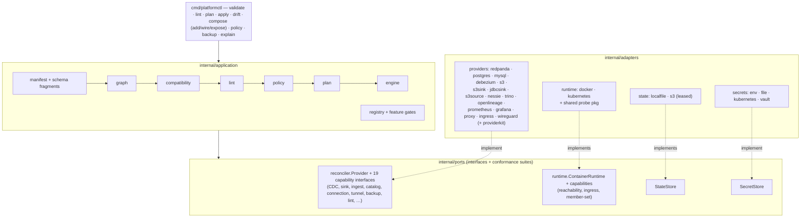

<div align="center">

# 🌐 Datascape

### `platformctl` — declarative data infrastructure on container runtimes

*Datascape — **d7s** for short — is the product; `platformctl` is the binary you run.*

*Describe your data platform as resources. Plan the diff. Apply it. Watch a
Postgres → Debezium → Redpanda → S3 pipeline reach `Ready` from a directory
of YAML.*

[](https://github.com/rezarajan/platformctl/actions/workflows/ci.yml)
[](go.mod)
[](#%EF%B8%8F-running-against-kubernetes)
[](docs/planning/08-production-readiness-plan.md)

</div>

---

Datascape treats the *infrastructure of a data platform* — databases, event
streams, CDC connectors, object storage, sinks — the way Kubernetes treats
workloads and Terraform treats cloud resources: a **typed resource model**,
a **deterministic plan**, an **idempotent reconciliation engine**, and
**drift-aware status**, all from one static binary.

```console
$ platformctl apply ./platform/ --auto-approve
ok   Provider/local-redpanda        (create) in 2.7s
ok   EventStream/attendance-events  (create) in 213ms
ok   Provider/local-postgres        (create) in 2.7s
ok   Provider/postgres-cdc          (create) in 6.7s
ok   Source/student-database        (create) in 53ms
ok   Binding/student-db-to-events   (create) in 254ms   # Debezium connector: RUNNING
...
applied: 14 succeeded, 0 failed, 0 skipped
```

## ✨ What you get

**Build**
- **Blueprints and lego blocks** — `init` scaffolds a validating platform;
  `add pipeline|source|sink|catalog|monitoring`, `wire`, and `expose`
  compose new pieces into an existing set interactively or via flags,
  reusing what you already have. Composition emits reviewable YAML —
  it never applies anything behind your back.
- **A real lakehouse, end-to-end** — 17 technology providers (table below)
  cover broker, CDC, object store, sinks/sources, catalog, query, lineage,
  monitoring, and connectivity. Rows inserted into Postgres land as
  schema-evolved Parquet in a bucket with nothing hand-wired in between.
- **Deterministic by construction** — `plan` is a pure diff of manifests vs
  recorded state; re-applying an unchanged set makes **zero mutating
  calls** (conformance-tested, not aspirational).

**Operate**
- **Drift-aware, failure-first** — `drift` probes live infrastructure;
  `apply` heals killed containers, restarted brokers, failed connectors;
  `destroy` converges even when half the platform is already dead. A
  chaos suite (Docker **and** Kubernetes) SIGKILLs the CLI mid-apply and
  requires convergence. "Ready" means *serving right now* — every
  provider's reconcile runs the same check its probe does (NFR-11).
- **Production-shaped HA** — multi-broker Redpanda, multi-worker Kafka
  Connect (both runtimes), erasure-coded multi-node MinIO; dead-letter
  queues on any sink Binding; `backup`/`restore` for postgres, mysql, s3.
- **Two runtimes, one model** — the same manifests run on Docker and
  Kubernetes (`spec.runtime.type` is the only change); a shared
  conformance suite holds both adapters to identical semantics, and the
  Kubernetes adapter is exercised in CI on every PR under a
  minimal-RBAC ServiceAccount, never cluster-admin.

**Connect & secure**
- **Stable entrypoints** — managed `Connection`s give anything a
  platform-owned address: TCP proxy, HTTP(S) ingress with TLS
  termination (operator certs, self-signed CA, or cert-manager), or a
  **WireGuard tunnel** for databases reachable only inside a VPC —
  with `spec.via` confining that egress to the Connection's own
  forwarder (blast-minimized, negatively tested).
- **Cloud-managed databases** — external Connections declare outbound
  TLS (`require`/`verify-ca`/`verify-full` + CA bundles via
  `SecretReference`); Debezium and the JDBC sink dial RDS/Cloud SQL/Azure
  with real verification. The auth-proxy and VPN topologies are
  documented walkthroughs, not exercises for the reader.
- **Secrets stay out of manifests** — `SecretReference` resolves through
  pluggable backends (`env`, `file`, `kubernetes`, gated `vault`); specs
  carry names, never values; state and logs carry fingerprints only.

**Govern & extend**
- **Design lints** — `platformctl lint` runs deterministic best-practice
  checks (orphaned resources, duplicate capture, replication floors —
  15 codes, provider-extensible), waivable per-resource *with a recorded
  reason*. Advisory by design: you stay in charge.
- **Policy engine** — a separate `--policies` channel enforces
  organizational rules (deny-wins, exemptions only where a rule permits
  them); `policy init zero-trust` writes a tailorable starter pack;
  `policy test` runs in CI.
- **Capability-checked at validate** — a `Binding(mode: cdc)` against a
  provider that can't do CDC, an unsupported sink format, a topic
  replication factor exceeding the broker count: all fail at `validate`
  with precise errors, not at 2 a.m. during `apply`. Every provider's
  configuration block is schema-validated from provider-owned fragments.
- **Feature-gated evolution** — every provider ships behind a gate, so
  `main` is always releasable; `platformctl explain <anything>` explains
  every condition, reason, and lint/policy code the tool can emit.

## 🏗 Architecture

Strict hexagonal layering — the entire design hangs on one invariant:
**domain and ports never import an adapter.**



| Layer | Rule |
|---|---|
| `internal/domain` | Imports nothing else in this repo. Resource kinds, graph, naming, status/explain catalog. |
| `internal/ports` | Interfaces only (+ conformance suites). Imports `domain`. |
| `internal/adapters` | Implement ports; may import third-party SDKs. Every runtime adapter passes the shared conformance suite. |
| `cmd/platformctl`, `application/registry` | The **only** places allowed to import concrete adapters. |

Cross-cutting mechanics worth knowing before reading code:

- **The command pipeline** is `validate → lint → policy → plan → apply`,
  with `drift` as the read-side probe. Everything a provider could reject
  at apply time is pushed to `validate` (ADR 011): capability pairing,
  provider-owned configuration schemas, replication floors, secret
  preflight.
- **Providers are stateless per call.** Every method receives one
  `reconciler.Request` — the resource, the runtime, resolved secrets, the
  full validated set, and engine-resolved *facts* (published endpoints of
  other providers: schema registry, catalog, tunnel, metrics targets).
  Providers never construct another provider's address by convention
  (ADR 015) — they read what was published.
- **The connectivity plane**: providers never dial raw addresses; they ask
  the runtime (`EnsureReachable`/`WithReachable`) and re-resolve per
  attempt. This is what makes the same provider code correct on Docker
  (container names) and Kubernetes (services/port-forwards).
- **"Ready" means serving** (NFR-11): reconcile runs the same serving
  check probe does, inside a bounded condition-poll — never a fixed sleep,
  never a weaker proxy signal. Drift immediately after apply is clean.

### The resource model

Nine kinds; nouns, not technologies. Engines *realize* kinds and are
capability-checked at `validate`:

```
Source(postgres) ──Binding(cdc)──▶ EventStream ──Binding(sink)──▶ Dataset(bucket/prefix)
      │                 │               │                │                │
  Provider(postgres) Provider(debezium) Provider(redpanda) Provider(s3sink) Provider(minio)
                                                             SecretReference(env) ⤴

Catalog(engine: nessie, warehouseRef)   # a table catalog as a noun
Connection(port, target | external)     # a stable entrypoint: proxy, ingress+TLS,
                                        #   or wireguard tunnel (spec.via);
                                        #   external: true consumes an address as-is,
                                        #   with outbound TLS modes for cloud DBs
```

`Binding` is the connective tissue: a directed edge whose `mode` names the
movement mechanism (`cdc`, `sink`, `ingest`), admitting a set of Kind
pairings — databases are legitimate sinks, object stores legitimate
sources (docs/adr/001). Direction lives in the Binding; asset kinds stay
role-neutral.

### Provider maturity

| GA | Beta | Alpha (gated, off by default unless noted) |
|---|---|---|
| redpanda, postgres, debezium, s3/minio, s3sink, mysql/mariadb | Kubernetes runtime | trino, prometheus, grafana, ingress, jdbcsink, s3source, wireguard, nessie/openlineage (lakehouse pair), backup/restore, policy engine; design lints (on) |

### Writing your own provider

The seam is small and the scaffolding is real: implement
`reconciler.Provider` (three methods — `Reconcile`, `Probe`, `Destroy` —
plus any capability interfaces you support), ship a JSON-Schema fragment
for your `configuration` block, register in `cmd/platformctl/main.go`
behind a feature gate, and add a row to `scripts/test-impact.sh`.
`providerkit` gives you instance lifecycle, credential/endpoint
resolution, TLS plumbing, and worker-set probing; the runtime conformance
suite guarantees your provider behaves identically on Docker and
Kubernetes if you only talk through the port. Start from
`internal/adapters/providers/nessie` (small) or `wireguard` (recent,
demonstrates the full settle/probe discipline);
[docs/onboarding/developers.md](docs/onboarding/developers.md) is the
step-by-step.

## 🚀 Quickstart

**Prerequisites:** Go 1.22+, a running Docker daemon.

```sh
git clone https://github.com/rezarajan/platformctl && cd platformctl
just build        # → bin/platformctl
```

Scaffold a platform instead of hand-writing one — `init` writes a manifest
set that already validates as-is, a `.env` template naming every secret key
it needs, and a README:

```sh
bin/platformctl init cdc-to-lake         # postgres → debezium → redpanda → s3sink → minio
bin/platformctl validate cdc-to-lake     # green immediately, no edits
```

`init --list` enumerates every shipped blueprint (`-o json|yaml` for the
machine-readable form); `cdc-to-lake`, `lakehouse` (adds a Nessie catalog,
Marquez lineage, and an externally-hosted CDC source), `stream-basics`
(just a broker and topics), and `external-cdc` (a Connection-fronted
external database) cover the common starting shapes. Fill in `.env`, then:

```sh
# one-time: the sink Connect image (stock images ship no S3 sink plugin)
docker build -t datascape-s3sink-connect:local cdc-to-lake/s3sink-image/

bin/platformctl apply  cdc-to-lake --env-file cdc-to-lake/.env --auto-approve
bin/platformctl status cdc-to-lake
```

Any secret left unset in `.env` is named explicitly by `apply`'s Preflight
check before anything is touched — never an opaque mid-apply failure.
Insert a row, watch it land in the lake (`platformctl inventory
cdc-to-lake` shows the auto-assigned host ports and which `SecretReference`
holds each credential):

```sh
psql postgres://admin:<db-admin-password>@localhost:<db-port>/appdb \
  -c "CREATE TABLE records (id serial PRIMARY KEY, payload text);
      INSERT INTO records (payload) VALUES ('alice'), ('bob');"

mc alias set local http://localhost:<lake-port> <lake-user> <lake-password>
mc ls --recursive local/raw-events/       # objects appear within ~30s
```

Only tables declared on the CDC Binding (`options.tables`) are captured —
add a table there and re-apply to widen the stream; the connector is
reconfigured in place. See the
[cdc-to-lake blueprint's README](internal/application/blueprint/templates/cdc-to-lake/README.md)
(written alongside the manifests by `init`) for the full walkthrough, or
[examples/cdc-attendance/README.md](examples/cdc-attendance/README.md) for
the hand-written, fixed-port version of the same pipeline this blueprint is
derived from.

Tear it all down (reverse dependency order, labeled objects only):

```sh
bin/platformctl destroy cdc-to-lake --auto-approve
```

## 🧭 Beyond the quickstart

Compose instead of hand-writing — every command below emits reviewable
YAML into your set and never applies anything:

```sh
platformctl add pipeline --name orders --engine postgres \
    --broker existing:broker --sink existing:raw-lake --sink-prefix orders/
platformctl expose Source/orders --scheme tcp     # stable entrypoint
platformctl lint . && platformctl apply . --auto-approve
```

Common production shapes, each a documented walkthrough:

| Scenario | Mechanism | Where |
|---|---|---|
| CDC from a **cloud-managed DB** (RDS / Cloud SQL / Azure) | External `Connection` + `spec.tls.mode: verify-full` + CA bundle `SecretReference` | docs/planning/03 §8.2.4 |
| DB behind a **cloud auth proxy** (IAM auth) | Run the cloud's proxy; External Connection at its socket | docs/adr/025 |
| DB reachable only through a **VPN into a VPC** | `wireguard` Provider + `Connection.spec.via` — egress confined to the forwarder | docs/adr/023 |
| HTTPS entrypoints with real certs | `ingress` Provider + `Connection.spec.tls` (secretRef / selfSigned / cert-manager) | docs/planning/03 §8.2.2 |
| Fleet monitoring | `prometheus` + `grafana` Providers — scrape targets resolved from published facts, exporters run least-privilege | docs/planning/08 C9 |
| Org guardrails | `policy init zero-trust`, tailor, commit; `policy test` in CI | docs/onboarding/users.md §governance |
| Backup / restore | `platformctl backup Source/db --to s3://…` and back | docs/adr/007 |

## 🖥 CLI surface

| Command | What it does |
|---|---|
| `init <blueprint> [--dir]` | Scaffold a ready-to-apply manifest set + `.env` template + README from an embedded blueprint (`cdc-to-lake`, `lakehouse`, `stream-basics`, `external-cdc`). `--list` enumerates blueprints (`-o json\|yaml` for the machine-readable form). |
| `validate <dir>` | Schema + graph (cycles) + Binding capability checks. No state, no runtime calls. |
| `lint [dir]` | Deterministic design lints over a valid set (ADR 020): built-in DL codes + provider-contributed checks; waivable per-resource with a reason; `--strict` exits `1` on warnings. |
| `policy test [dir]` | Evaluate typed governance policies (ADR 021) against a manifest set without the rest of validate — a fast authoring loop. Exits `1` on any unexempted deny. Alpha, `PolicyEngine` gate. |
| `policy init <pack>` | Write a built-in policy pack (`zero-trust`) for local tailoring — same blueprint pattern as `init`. |
| `explain <token>` | Explain any condition type, status reason, or lint code from the built-in catalog: meaning, likely causes, remedies. |
| `plan <dir>` | Deterministic diff of manifests vs. state. Exit `1` when changes are pending. |
| `apply <dir>` | Reconcile in topological order; state persisted after every resource. |
| `add <composite> [path]` | Compose a new building block (`source`, `pipeline`, `sink`, `catalog`, `monitoring`) into an existing manifest set — reusing compatible resources via prompts or flags; emits blueprint-quality YAML, never applies (ADR 024). |
| `wire <mode> --from <ref> --to <ref>` | Connect two existing blocks with a Binding (+ any missing glue). |
| `expose <Kind>/<name>` | Emit a stable entrypoint (Connection + realizing provider) for an existing block, scheme-selected. |
| `status <dir>` | Per-resource `Ready`/`DRIFT`/conditions/lifecycle from recorded state. |
| `drift <dir>` | Probe live infrastructure, record observed conditions into state, report drift. Exit `1` when drift is found; run `apply` to heal it. |
| `backup <Kind/name> [dir] --to ...` | Stream a `BackupCapableProvider` resource's contents (postgres, mysql, s3) to a `Dataset` or an object-store URL. Alpha, `BackupRestore` gate. |
| `restore <Kind/name> [dir] --from ...` | Stream a backup back into a resource, overwriting its current data; refuses without `--yes-i-understand-this-overwrites-existing-data`. Alpha, `BackupRestore` gate. |
| `graph <dir> [--format tree\|dot\|mermaid\|json]` | Render the platform architecture — data-flow pipelines + technology layer, not the raw dependency DAG. `-o json\|yaml` overrides `--format` with a structured node/edge document. |
| `inventory <dir>` (aka `services`, `endpoints`) | List applied components' endpoints + which SecretReference holds their credentials. `--for dagster\|dbt\|flink\|kafka\|metabase\|prometheus\|psql\|s3\|spark\|superset\|trino` renders a paste-ready config snippet from the recorded endpoints instead. |
| `import <Kind>/<name> --from <name>` | Adopt a pre-existing backing object into state as Imported (probe, never create). Gated by `ImportedResources`. |
| `docs build\|serve` | Generate/serve the resource reference from `schemas/`. |
| `destroy <dir>` | Reverse-order teardown. `--include-external` additionally requires `--yes-i-understand-this-is-destructive`. |
| `gc plan [--runtime docker\|kubernetes]` | List every labeled container/network/volume that no state entry accounts for (read-only). |
| `gc apply [--runtime docker\|kubernetes] --yes-i-understand-this-is-destructive` | Remove exactly the objects `gc plan` lists. |
| `state inspect` | Dump the normalized state file (read-only). |
| `state doctor [--runtime docker\|kubernetes]` | Report state defects: stale on-disk format, legacy orphan entries, corrupt key/manifest mismatches, Provider entries whose backing container is gone. Exit `1` when any check finds something. |
| `state repair [--runtime docker\|kubernetes] [--yes]` | Apply doctor's safe fixes: persist a migrated format, drop entries for confirmed-gone Provider objects. No-op on healthy state. |
| `state unlock` | Force-release the state lock (escape hatch for a holder process that died). |

Global flags: `--state-file` (default `.datascape/state.json`, local backend),
`--feature-gates`, `-o table|json|yaml`, `--policies` (directory of Policy
documents, ADR 021; default `.datascape/policies/` if it exists — evaluated
at validate/plan/apply/destroy when the `PolicyEngine` gate is enabled).
Shared state
(`docs/adr/003-shared-state.md`, gated `SharedStateBackend`):
`--state-backend s3 --state-bucket ... --state-endpoint ... --state-secret-ref
...` points every command at an S3-compatible bucket instead of a local file,
with a lease-based lock so two operators can't corrupt each other's apply.

## ☸️ Running against Kubernetes

Set `spec.runtime.type: kubernetes` on a Provider to reconcile against a real
cluster instead of the local Docker daemon, using the standard kubeconfig
loading rules (`config["kubeconfig"]`/`config["context"]` override). The
`KubernetesRuntime` feature gate is Beta (enabled by default) — no
`--feature-gates` flag needed; `--feature-gates KubernetesRuntime=false`
turns it back off. `validate`/`plan` preflight the cluster — connectivity and
every permission the adapter needs — before any mutating call, naming exactly
what's missing.

`spec.runtime.access` (`port-forward` default | `node-port` | `load-balancer` |
`in-cluster`) controls how platformctl itself, running outside the cluster,
reaches a Provider's admin/control-plane port to reconcile child resources
(e.g. redpanda's EventStream needs a live Kafka admin connection) —
`port-forward` needs no cluster config beyond RBAC; `node-port`/`load-balancer`
change the backing Service's type and are what `platformctl inventory` reports
as the reachable endpoint.

RBAC: see [`deploy/kubernetes/rbac/`](deploy/kubernetes/rbac/README.md) for
the minimal ClusterRole/ServiceAccount/binding manifests (exactly the verbs
the adapter uses, kept in sync with the preflight check) and the cluster-admin
dev shortcut. CI's Kubernetes integration job runs the full K8s test suite
under that minimal role against a fresh `kind` cluster to prove it's actually
sufficient.

## 🗄 Database HA posture

Managed `postgres`/`mysql` are deliberately **single-node**, positioned for
dev, staging, and small production — hardened by `platformctl backup`/
`restore` (Alpha, `BackupRestore` gate) and fast drift-heal, not by
reimplementing replication.
Patroni, Galera, and cloud RDS/Aurora are operationally deep enough that
platformctl doesn't try to own that surface; instead, a production HA
database integrates as an **`external: true` Source through the Connection
seam** — already fully supported today, CDC included (see
`examples/lakehouse/sources-and-datasets.yaml`'s `orders` Source). See
[`docs/adr/005-database-ha-posture.md`](docs/adr/005-database-ha-posture.md)
for the full decision and what would change if a replication-capable managed
mode is ever added.

## 🔀 platformctl and Terraform

Same family: declarative desired state, `plan`/`apply`, a state file, drift
— platformctl deliberately borrows Terraform's authoritative-apply and
state conventions
([docs/adr/012-determinism-and-state.md](docs/adr/012-determinism-and-state.md)).
The difference is depth and scope, not just tooling:

- **Reconciliation depth.** Terraform provisions resources through
  cloud/provider APIs and stops at resource CRUD. platformctl continues
  past creation into application-level reconciliation — creating topics
  inside a broker it just started, enabling logical replication inside a
  database, registering and health-verifying Kafka Connect connectors,
  checking that a connector's *live config* still matches the manifest
  (drift here means `wal_level changed`, not just "the VM is gone"),
  rotating credentials, backing up and restoring data.
- **Runtime portability.** One manifest reconciles to Docker locally and
  Kubernetes in staging with zero manifest changes (`spec.runtime.type`) —
  the provider/runtime split is this architecture's central bet, and it's
  Docker-first by design, the opposite of Terraform's cloud-API-first
  starting point.
- **Typed, validate-time-complete domain model.** A `Binding` to a provider
  that can't do CDC fails at `validate` with a precise capability error;
  Terraform's equivalent errors mostly surface at `apply`, from the
  provider, if at all.
- **Scope.** platformctl is deliberately not a general-purpose provisioner
  (no VPCs, IAM, DNS, managed cloud services) and has no multi-tenant
  control plane — that's squarely Terraform's territory.

**Use them together, today:** Terraform provisions the cloud foundation
(the RDS instance, the S3 bucket, the network); platformctl consumes it as
an `external: true` resource through the `Connection` seam and owns what
runs on top of it — "CDC off it is running, healthy, and its connector
config hasn't drifted." This is the shipped, CI-exercised pattern (see
`examples/lakehouse/sources-and-datasets.yaml`'s `orders` Source and
docs/planning/08 C4's external object-store posture), not a roadmap item.

Full comparison, an honest "when to use Terraform instead," and unscheduled
future-integration ideas (a Terraform runtime adapter, the inverse
platformctl-as-a-Terraform-provider, a state bridge):
[docs/positioning/terraform.md](docs/positioning/terraform.md).

## 🧪 Development

```sh
just build             # CGO_ENABLED=0 static build
just test              # unit + contract tests (no Docker)
just test-affected     # impact-mapped, ledger-deduped integration suites for your diff
just test-integration  # real Docker: the full suite (runtime conformance + every provider e2e)
just check             # gofmt + go vet (both build-tag variants)
golangci-lint run      # tuned .golangci.yml, 0 issues enforced in CI
```

The integration suite stands up real Postgres, Debezium, Redpanda, and MinIO
containers on non-default host ports and verifies the roadmap's exit
criteria literally — including "re-apply makes zero mutating calls" and
"destroy leaves no orphans". A chaos-monkey suite additionally kills and
stops managed containers out-of-band (and SIGKILLs the CLI mid-apply) and
requires drift reporting, healing, recovery, and convergent teardown.
`just test-affected` (`scripts/test-impact.sh --base main`) is the
day-to-day default for contributors — it maps your diff to only the
integration suites it could plausibly affect and skips any suite already
proven green against the same content-state (a shared ledger keyed by a
hash of each suite's scoped files, including uncommitted changes), so
routine changes don't re-earn a green they already have
(docs/planning/06-agentic-execution-guide.md §10).

**Adding a provider:** implement `reconciler.Provider` (plus capability
interfaces you support), register it in `application/registry` wiring behind
a feature gate, and cover it with an integration test. Every call receives a
single `reconciler.Request` — your `Provider` resource, the runtime,
resolved secrets, and the full validated resource set — so providers are
stateless per call (docs/planning/02 §4.2); see
`internal/adapters/providers/nessie` for a small, complete template (or
`internal/adapters/providers/redpanda` for the larger multi-instance/
StableIdentity shape). The full walkthrough — plus `providerkit`, the
feature-gate/impact-map steps, and where the process docs live — is
[docs/onboarding/developers.md](docs/onboarding/developers.md).

## 📚 Documentation

[docs/README.md](docs/README.md) maps the whole documentation tree —
contracts vs. plans vs. historical records. New here? Start with
[docs/onboarding/users.md](docs/onboarding/users.md) (operating platformctl)
or [docs/onboarding/developers.md](docs/onboarding/developers.md)
(contributing to it). The load-bearing planning pieces:

| Doc | Contents |
|---|---|
| [01-product-requirements](docs/planning/01-product-requirements.md) | What Datascape is (and deliberately isn't). |
| [02-architecture](docs/planning/02-architecture.md) | Layering, ports, capability interfaces, error contracts. |
| [03-resource-model-reference](docs/planning/03-resource-model-reference.md) | Every Kind, field by field. |
| [04-roadmap-and-feature-gates](docs/planning/04-roadmap-and-feature-gates.md) | Phases 0–8 and the feature-gate master table. |
| [08-production-readiness-plan](docs/planning/08-production-readiness-plan.md) | **The live, stage-gated backlog** (Stages A–F). |
| [10-project-history-and-evolution](docs/planning/10-project-history-and-evolution.md) | The full history, with reasoning, commit-anchored. |
| [positioning/terraform](docs/positioning/terraform.md) | How platformctl compares to, and works alongside, Terraform. |

**Status:** v1.0.0 shipped (Phases 0–5, every exit criterion automated; the
acceptance scenario runs in CI against the literal example manifests),
followed by Phase 6 (parallel reconciliation, vault backend) and Phase 6.5
(the orchestrator-ready lakehouse: MySQL/MariaDB, Nessie `Catalog`, Marquez
lineage, managed `Connection`s). Since then: Stage A (operational
hardening — shared S3 state, `gc`/`state doctor`, registry auth, deletion
protection), Stage B (the Kubernetes runtime to **Beta**, enabled by
default), and Stage F (systemic segregation-readiness fixes — the
`reconciler.Request` provider contract, explicit port audiences, one
reachability path) are closed. In progress: Stages C (HA, ingress/TLS,
monitoring, backup), D (schema registry → Parquet, JDBC sink, ingest,
tunnels, Trino), and E (blueprints — `init` shipped — and the
provider-author contract). Binding taxonomy is a relation over role-neutral
asset kinds — database-as-sink and object-store-as-source are schema-stable
pairings awaiting providers (docs/adr/001).

---

<div align="center">
<sub>Built docker-first on purpose: the resource model was validated against
the cheapest real runtime before the Kubernetes adapter (phase 7, Beta) proved
it portable — Terraform (phase 8) is still future work.</sub>
</div>
