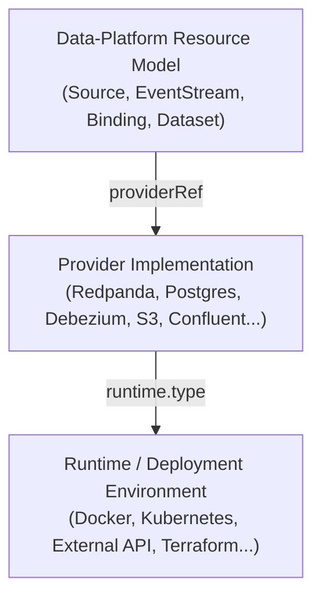

# Datascape — Production Rebuild: Planning Package

This is the canonical planning package for taking `project-datascape` out of its experimental
phase and into a production-grade v1. It is greenfield with respect to design — it does not
assume the current `internal/` layout, resource-kind list, or CLI surface survive unchanged.

## How to read this package

1. **[01-product-requirements.md](01-product-requirements.md)** — what Datascape is, who it's
   for, what it must do, what it explicitly will not do.
2. **[02-architecture.md](02-architecture.md)** — how it's built: module layout, domain/ports/
   adapters, the reconciliation engine, state management, capability matching, lineage
   observation, CLI.
3. **[03-resource-model-reference.md](03-resource-model-reference.md)** — the actual API: every
   Kind, every field, the managed/external/imported lifecycle taxonomy, status conditions.
4. **[04-roadmap-and-feature-gates.md](04-roadmap-and-feature-gates.md)** — the phased build-out,
   phase-by-phase exit criteria, and the feature gate system.
5. **[05-v1-first-version-spec.md](05-v1-first-version-spec.md)** — the precise, testable
   definition of "production-grade first version," including the worked acceptance scenario.
6. **[06-agentic-execution-guide.md](06-agentic-execution-guide.md)** — how to actually build
   this with Claude Code and other coding agents: repo structure, standing bookkeeping tasks,
   pre-coding review checklist, and model selection per task type.
7. **[07-production-grade-docker-runtime-gap-analysis.md](07-production-grade-docker-runtime-gap-analysis.md)**
   — the post-v1.0.0 gap analysis and stage gates (Gates 0–3), including the
   cross-runtime (Kubernetes) portability findings. Analysis record; its open
   items are worked through the backlog below.
8. **[08-production-readiness-plan.md](08-production-readiness-plan.md)** — the
   current stage-gated backlog (Stages A–F) of individually actionable tasks
   taking v1.0.0 to a production data-pipeline platform: operational
   hardening, Kubernetes to Beta/GA, HA/routing/TLS/monitoring/backup,
   pipeline-infrastructure providers, DX/contribution readiness, and the
   segregation-readiness fixes from doc 09.
8a. **[10-project-history-and-evolution.md](10-project-history-and-evolution.md)**
   — the consolidated historical record: every phase, stage gate, audit,
   and course-correction with the reasoning behind it, commit-anchored.
   Read it to understand *why* the project is shaped this way; read doc 08
   to find what to work on. (A map of the whole `docs/` tree — contracts
   vs. plans vs. records — lives in [../README.md](../README.md).)
9. **[09-systemic-findings-and-segregation-readiness.md](09-systemic-findings-and-segregation-readiness.md)**
   — the post-Stage-B audit of every bug that only live testing caught: the
   five recurring failure classes, the systems-level changes (doc 08 Stage F)
   that close each class for all providers at once, the production-plane
   analysis, and the definition of done for segregating core from
   provider-specific logic (Phase 8 readiness).
10. **[12-path-to-production.md](12-path-to-production.md)** — the actionable
   plan from "runs on a dev machine" to "tech firms rely on it": the four
   confidence pillars (design/DX/value/stability), the phased sequencing with
   gates, and the full task backlog (formal-verification spine from ADR 037,
   runtime breadth, reliability, security, DX, value, release). Every task is
   pick-up-ready for a human or an agent. Read this to find what to work on
   *next*, toward 1.0-GA.

## The one diagram that explains everything else

Everything in this package exists to keep these three layers from collapsing into each other.
The resource model must never know about Docker. The Docker adapter must never know what a
topic or a replication slot is. The provider is the only thing that understands both a
technology's semantics *and* how to ask a runtime to host it.

## Key design decisions

These decisions constrain everything else in this package. If any is wrong for your intent, say
so before treating the rest as settled.

| Decision | What it means | Why |
|---|---|---|
| **Collapse `*Class`/`*Instance` pairs into `Provider`** | `DatabaseClass`, `ConnectorClass`, `CDCClass`, `DatabaseInstance`, `CDCInstance` are retired. A single `Provider` kind (`type` + `runtime` + `configuration`) replaces all five. | The class/instance split was solving a problem (reusable policy vs. concrete deployment) that `providerRef` + `runtime` already solves more simply. |
| **Retire Kubernetes-shaped volume kinds for v1** | `StorageClass`, `PersistentVolume`, `PersistentVolumeClaim`, `VolumeMountBinding` are deferred, not deleted from the vocabulary. Docker-native volumes are managed internally by the Docker runtime adapter. | Mimicking Kubernetes storage abstractions before there's a second runtime to abstract *over* is premature generality. |
| **`Source` is one Kind with an extensible, engine-keyed sub-block** | `spec.engine: postgres` plus `spec.postgres: {...}`; a new engine is a schema fragment and a provider declaration, not a core schema change. | Collapsing `RelationalSource` into `Source` only works if the result is genuinely extensible per-provider — a discriminator plus an opaque, provider-owned sub-block delivers that without a Kind per technology. |
| **`Warehouse`, `Table`, `Pipeline`, `LineageSink`, `AuditStore` are out of v1 scope entirely** | Not modeled at all in v1. | These describe *what happens to data after it lands* — orchestration/transformation territory, explicitly out of scope. |
| **Compatibility is a provider capability, not a type-system guarantee** | `CDCCapableProvider.SupportedSourceEngines()` and `SinkCapableProvider.SupportedSinkFormats()` are consulted at `validate`/`plan` time, with a documented error shape. | Wiring a `Source` to a `Provider` that can't actually speak that engine is a configuration mistake, not a type error — catch it early, with a clear message. |
| **Lineage is observed, never synthesized** | Datascape resolves a lineage backend's `LineageEndpoint` (connection details only) and hands it to a provider that implements `LineageAware`. It never constructs a Job/Run/Dataset fact itself. | Real lineage tools (OpenLineage) model *job execution*, produced by the tool doing the work. Datascape reconciling infrastructure is not a job execution. Where a tool already does this natively — Debezium ships its own OpenLineage integration — Datascape's job shrinks to forwarding configuration, nothing more. |
| **Object storage ships in v1.0.0, mechanism-complete; lineage integration does not have to** | `Provider(type: s3\|minio)` + `Dataset` + `mode: sink` `Binding`s are required v1.0.0 deliverables. The `LineageAware`/`observers` *mechanism* is required and tested; a concrete lineage-backend provider (e.g., one that stands up Marquez) is optional. | CDC into a stream with nowhere durable to go is an incomplete platform story, and `Dataset` is also the input contract future orchestrator-facing providers (Dagster, etc.) will need. Lineage's mechanism matters now; its integration value depends on tools this project doesn't yet reach. |
| **Keep `SecretReference`** | `spec.backend` ∈ {`env`, `file`, `kubernetes`, `vault`}, `spec.keys` is a logical key list. Secrets are always references, never inline values. | This was already right in the experimental phase. |
| **Keep the Kubernetes-familiar envelope** | `apiVersion`/`kind`/`metadata`/`spec`/`status` stays. | Developers already pattern-match this instantly; the goal is not to be Kubernetes, but to borrow its literacy. |
| **CLI binary stays `platformctl`** | Project/product name is Datascape; the compiled binary and command surface remain `platformctl`. | No functional reason to rename; renaming has real cost for zero design benefit. |
