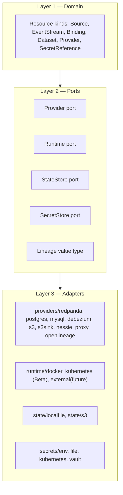

# Datascape — Technical Architecture

## 1. Layering recap



Dependencies point inward: `domain` imports nothing else in this repo. `ports` imports only
`domain`. `adapters` implement `ports` and may import third-party SDKs (Docker client, pgx,
Kafka Connect REST client). The `application` layer wires adapters to ports and ports to domain;
nothing outside `application` and `cmd` knows concretely which adapter is in use.

## 2. Module layout

```text
.
├── cmd/
│   └── platformctl/            # main package, cobra command tree, wiring/DI only
├── internal/
│   ├── domain/
│   │   ├── resource/            # Resource envelope, Metadata, GroupVersionKind
│   │   ├── source/               # spec.engine discriminator + per-engine extensible block
│   │   ├── eventstream/           # EventStream kind + validation
│   │   ├── binding/               # spec.mode ∈ {cdc, sink, batch(reserved)}
│   │   ├── dataset/                # Dataset kind + validation
│   │   ├── provider/                # Provider kind + validation
│   │   ├── secret/                   # SecretReference kind
│   │   ├── catalog/                   # Catalog kind (engine-discriminated, Phase 6.5)
│   │   ├── connection/                # Connection kind (managed entrypoint / external address)
│   │   ├── status/                    # Condition, ConditionType, rollup logic
│   │   ├── lineage/                    # LineageEndpoint value type
│   │   ├── endpoint/                   # endpoint facts providers publish (inventory + F4 lookup)
│   │   ├── naming/                     # the single resource→runtime-object naming authority (F4)
│   │   ├── hostport/                   # deterministic auto-allocated host ports
│   │   ├── storagesize/                # size-string parsing for configuration.storage
│   │   ├── versionprofile/             # immutable per-version image+internals profiles
│   │   └── graph/                       # Dependency graph builder + topological sort
│   ├── ports/
│   │   ├── runtime/              # ContainerRuntime interface + value types (NetworkSpec, VolumeSpec, ContainerSpec, HealthCheck)
│   │   ├── reconciler/            # Provider interface + capability sub-interfaces (CDCCapableProvider, SinkCapableProvider, LineageAware)
│   │   ├── state/                  # StateStore interface
│   │   ├── secretstore/              # SecretStore interface
│   │   └── clock/                     # Clock interface (testability: fake time in tests)
│   ├── archtest/                  # architecture tests (layering grep, F1 loopback ban)
│   ├── adapters/
│   │   ├── kafkaconnect/          # shared Kafka Connect REST client (debezium + s3sink)
│   │   ├── runtime/
│   │   │   ├── docker/            # real Docker adapter (Docker Engine API client)
│   │   │   ├── fake/                # in-memory runtime for unit + contract tests — the strict interpreter (08 F2)
│   │   │   └── kubernetes/           # real cluster adapter (client-go) — Beta since 08 Stage B; external/terraform remain Phase 8
│   │   ├── providers/
│   │   │   ├── redpanda/
│   │   │   ├── postgres/
│   │   │   ├── mysql/               # also registered as mariadb
│   │   │   ├── debezium/            # also implements LineageAware
│   │   │   ├── s3/                    # object store engine (e.g. MinIO)
│   │   │   ├── s3sink/                  # Kafka-Connect-based sink connector, implements SinkCapableProvider
│   │   │   ├── nessie/                # realizes Catalog(engine: nessie), CatalogCapableProvider
│   │   │   ├── proxy/                 # realizes managed Connections, ConnectionCapableProvider
│   │   │   ├── openlineage/           # lineage backend (Marquez + its metadata Postgres)
│   │   │   ├── noop/                  # test-only
│   │   │   └── placeholder/           # test-only ("container" type)
│   │   ├── state/
│   │   │   ├── localfile/           # JSON file + advisory lock
│   │   │   └── s3/                  # shared/remote backend, lease-locked (docs/adr/003; SharedStateBackend gate)
│   │   └── secrets/
│   │       ├── env/
│   │       ├── file/
│   │       ├── kubernetes/          # native K8s Secrets (08 B4; KubernetesSecretBackend gate)
│   │       ├── vault/               # KV v2 (VaultSecretBackend gate)
│   │       └── router/              # backend-keyed dispatch
│   ├── application/
│   │   ├── manifest/              # load, parse, schema-validate YAML/JSON into domain resources
│   │   ├── compatibility/           # Binding mode↔Kind rules + provider capability checks
│   │   ├── plan/                    # diff engine: desired vs. state (+ optional live probe)
│   │   ├── engine/                    # topological executor: runs Reconcile() per resource per plan; resolves + forwards LineageEndpoint
│   │   ├── registry/                    # provider type -> Provider constructor; runtime type -> Runtime constructor
│   │   ├── featuregate/                  # feature gate registry + stage metadata
│   │   ├── archview/                # architecture graph rendering (tree/dot/mermaid/json)
│   │   ├── blueprint/               # `platformctl init` embedded blueprints (08 E1)
│   │   └── docsgen/                 # docs/reference generation from schemas/ (+ HTML site)
│   └── cliutil/                    # output formatting (table/json), exit codes, flag helpers
├── schemas/                    # JSON Schema per apiVersion/kind, used for `validate` and editor tooling
├── examples/
│   ├── cdc-attendance/          # the worked acceptance scenario (Redpanda + Postgres + Debezium + MinIO sink)
│   └── lakehouse/               # the orchestrator-ready stack (Catalog/Connection/lineage, Phase 6.5)
├── docs/                       # this planning package + generated reference docs
└── scripts/ / justfile / Makefile
```

## 3. Domain layer

### 3.1 Resource envelope

```go
package resource

type GroupVersionKind struct {
    APIVersion string // e.g. "datascape.io/v1alpha1"
    Kind       string // e.g. "EventStream"
}

type Metadata struct {
    Name        string
    Namespace   string            // DNS-label, defaults to "default"; part of resource identity (Key = Namespace/Kind/Name) since Gate 0 (doc 07 §0.1)
    Labels      map[string]string
    Annotations map[string]string
    Observers   []ObserverRef     // optional; see §3.4
}

type ObserverRef struct {
    Name string // must resolve to a Provider
}

// Envelope is the parsed, validated form of any manifest before it's cast to a
// concrete typed resource (Source, EventStream, Binding, Dataset, Provider, SecretReference).
type Envelope struct {
    GroupVersionKind
    Metadata Metadata
    Spec     map[string]any // decoded further by the kind-specific package
    Status   Status
}
```

### 3.2 Lifecycle taxonomy

Every resource that can be targeted at infrastructure (`Source`, `EventStream`, `Binding`,
`Dataset`) carries a `Lifecycle` derived from its spec:

```go
type Lifecycle int

const (
    Managed  Lifecycle = iota // Datascape creates and operates it
    External                   // Datascape configures something that already exists; never deletes it
    Imported                   // Datascape discovered and adopted it; behaves like Managed going forward,
                                // but its creation is never re-attempted
)
```

`Lifecycle` is computed, not separately declared, from spec markers (`spec.external: true`, or
presence of `status.imported` set by a prior `import` run) — see the resource reference doc for
the exact per-kind rules. The reconciliation engine consults `Lifecycle` before issuing any
create/delete call — this is the single enforcement point for NFR-3 (safety).

### 3.3 `Source`: discriminator plus extensible, per-engine block

```go
package source

type Source struct {
    Engine        string          // "postgres" | "mysql" | ... — open-ended, not a closed enum
    ProviderRef   *string         // required unless External
    External      bool
    ConnectionRef *string         // required when External
    EngineConfig  map[string]any  // the spec.<engine> sub-block, validated by a per-engine schema fragment
}
```

The `EngineConfig` sub-block is intentionally opaque to the core `source` package — it's
validated by whichever schema fragment is registered for that engine string (contributed
alongside the `Provider` type that claims to speak it), the same way `Provider.spec.runtime`'s
fields beyond `type` are validated by the runtime adapter, not the core `provider` package. This
is what makes the model extensible per-provider: adding a new engine means adding a schema
fragment and a provider that declares support for it, not touching `domain/source`.

### 3.4 `Binding`: mode-driven Kind pairing

```go
package binding

type Mode string

const (
    ModeCDC   Mode = "cdc"   // sourceRef -> Source, targetRef -> EventStream
    ModeSink  Mode = "sink"  // sourceRef -> EventStream, targetRef -> Dataset
    ModeBatch Mode = "batch" // reserved, unimplemented
)

var allowedKindPairs = map[Mode]struct{ SourceKind, TargetKind string }{
    ModeCDC:  {SourceKind: "Source", TargetKind: "EventStream"},
    ModeSink: {SourceKind: "EventStream", TargetKind: "Dataset"},
}
```

This table is a structural rule of the `Binding` Kind itself (which Kinds are even meaningful to
connect for a given mode) — separate from provider *capability* (whether a specific provider can
actually do it), which is declared by the provider, not the domain layer. See §5.2.

### 3.5 `Dataset`

```go
package dataset

type Dataset struct {
    ProviderRef string // an s3/minio-typed Provider
    Bucket      string
    Prefix      string
    Format      string // "parquet" | "json" | "avro" — validated against the sink provider's SupportedSinkFormats()
}
```

### 3.6 Lineage value type

```go
package lineage

// LineageEndpoint is a connection fact, nothing more. It carries no notion of
// Job, Run, Dataset, or event — those are the lineage backend's and the
// consuming tool's concepts, not Datascape's.
type LineageEndpoint struct {
    URL       string
    Namespace string                    // optional; some backends want a namespace hint
    AuthRef   *secret.SecretReference   // optional
}
```

### 3.7 Status / Conditions

```go
package status

type ConditionType string

const (
    Ready         ConditionType = "Ready"
    Progressing   ConditionType = "Progressing"
    Degraded      ConditionType = "Degraded"
    DriftDetected ConditionType = "DriftDetected"
)

type Condition struct {
    Type               ConditionType
    Status             TriState // True | False | Unknown
    Reason             string
    Message            string
    LastTransitionTime time.Time
}

type Status struct {
    Conditions         []Condition
    ObservedGeneration int64
    ProviderState      map[string]any // opaque, provider-owned (e.g. container IDs, connector name)
}
```

This is intentionally Kubernetes-shaped — engineers already know how to read it — without
pulling in `client-go`/`controller-runtime` as a dependency.

## 4. Ports

### 4.1 Runtime port

```go
package runtime

type NetworkSpec struct{ Name string; Labels map[string]string }
type VolumeSpec struct{ Name string; Labels map[string]string }
type HealthCheck struct{ Test []string; Interval, Timeout time.Duration; Retries int }
type ContainerSpec struct {
    Name        string
    Image       string
    Networks    []string
    Volumes     []VolumeMount
    Env         map[string]string
    Ports       []PortBinding
    HealthCheck *HealthCheck
    Labels      map[string]string // Datascape ownership + generation labels for drift/GC
}

type ContainerRuntime interface {
    EnsureNetwork(ctx context.Context, spec NetworkSpec) error
    EnsureVolume(ctx context.Context, spec VolumeSpec) error
    EnsureContainer(ctx context.Context, spec ContainerSpec) (ContainerState, error)
    WaitHealthy(ctx context.Context, name string, timeout time.Duration) error
    Inspect(ctx context.Context, name string) (ContainerState, bool, error)
    Remove(ctx context.Context, name string) error
    RemoveNetwork(ctx context.Context, name string) error
    RemoveVolume(ctx context.Context, name string) error
    ListManaged(ctx context.Context) ([]ContainerState, error) // for drift/GC: everything labeled as Datascape-owned
}
```

Every method is `Ensure*`, not `Create*` — idempotent-by-contract at the interface boundary.
This is what makes NFR-2 enforceable: adapters are required to no-op when actual state already
matches spec, not just "usually" do so.

**Settledness rule (NFR-11, added by the 2026-07 production review, doc 08 I3/I4):** a
provider reports `Ready` only when the resource answers its declared protocol *at that
moment* — reconcile runs the SAME serving check its own `Probe` uses (no weaker proxy
signal: container-running ≠ serving; membership ≠ leadership), inside a bounded
condition-poll with an honest timeout error naming the last observed state. Fixed-duration
sleeps that assume completion are forbidden; correctness must not depend on machine speed.
The reference implementations: redpanda's `waitTopicSettled`, and the I4 settle-polls in
wireguard/ingress/proxy (which also demonstrate the runtime-aware bar — where a runtime
publishes no dial-through address, Probe's own guard on that runtime is the bar, keeping
reconcile exactly as strict as Probe, never stricter or weaker).

### 4.2 Provider (reconciler) port and capability interfaces

**Contract revision (docs/planning/08 Stage F, task F5 — 2026-07-20):**
providers originally received inputs via `Reconcile(ctx, res, rt)` plus an
accretion of optional setter interfaces (`ProviderResourceAware`,
`SecretsAware`, `ResourceSetAware`). That shape made providers stateful
(`Set*`-before-`Reconcile` was a temporal coupling the compiler could not
check), made every new cross-cutting input either a breaking signature
change or another `*Aware` interface plus an engine special case, and was
unserializable for the Phase 8 plugin protocol. It was replaced by a single
request-scoped struct; the setter interfaces are deleted. See
docs/planning/09 §3-F5 for the full rationale. The shape below is the
current contract (`internal/ports/reconciler/reconciler.go`):

```go
package reconciler

// Request is the single input to Reconcile/Destroy/Probe and every
// capability method that needs more than static config. Adding a field is
// non-breaking for every implementor (open/closed at the contract level);
// a zero field means "not resolved/applicable for this call". Providers
// hold no state across calls — their constructors take nothing but static
// config.
type Request struct {
    Resource  resource.Envelope                  // the envelope being reconciled/destroyed/probed
    Runtime   runtime.ContainerRuntime           // constructed for the realizing Provider's spec.runtime
    Provider  resource.Envelope                  // the realizing Provider resource (== Resource for Kind "Provider")
    Secrets   map[string]map[string]string       // resolved spec.secretRefs, by ref name then key
    Resources map[resource.Key]resource.Envelope // the full validated set, for related-resource lookup
}

type Provider interface {
    Type() string // "redpanda", "postgres", "debezium", "s3", "s3sink", ...
    Reconcile(ctx context.Context, req Request) (status.Status, error)
    Destroy(ctx context.Context, req Request) error
    Probe(ctx context.Context, req Request) (status.Status, error)
}

// ExternalConfigurer is the only capability allowed to configure resources
// declaring spec.external: true with a providerRef; enforced centrally by
// the engine, never per-provider convention (doc 07 §0.3).
type ExternalConfigurer interface {
    Provider
    ConfigureExternal(ctx context.Context, req Request) (status.Status, error)
}

// Declared by a provider that can sit behind a `mode: cdc` Binding.
type CDCCapableProvider interface {
    Provider
    SupportedSourceEngines() []string
}

// Declared by a provider that can sit behind a `mode: sink` Binding.
type SinkCapableProvider interface {
    Provider
    SupportedSinkFormats() []string
}

// Declared by a provider that can realize a Catalog resource; checked
// against Catalog.spec.engine at validate time.
type CatalogCapableProvider interface {
    Provider
    SupportedCatalogEngines() []string
}

// Declared by a provider that can realize a managed Connection (a stable
// platform-owned entrypoint); checked against Connection.spec.scheme.
type ConnectionCapableProvider interface {
    Provider
    SupportedConnectionSchemes() []string
}

// Declared by a provider that can sit behind a `mode: sink` Binding whose
// target is a Source (a database used in its sink role); no shipped
// provider implements it yet — the seam exists so database sinks land
// additively (docs/adr/001).
type DatabaseSinkCapableProvider interface {
    Provider
    SupportedSinkEngines() []string
}

// Declared by a provider that can sit behind a `mode: ingest` Binding
// (Dataset → EventStream); no shipped provider implements it yet.
type IngestCapableProvider interface {
    Provider
    SupportedIngestFormats() []string
}

// Optionally implemented: providers check their own Provider resource's
// configuration at validate time (required keys, configuration.*SecretRef
// entries that must also appear in spec.secretRefs) — a mis-wired Provider
// fails at `validate`, never as a half-applied platform.
type SpecValidator interface {
    Provider
    ValidateSpec(cfg provider.Provider) error
}

// Optionally implemented: providers validate a Binding's provider-specific
// spec.options block at validate time (same DX contract as SpecValidator).
type BindingOptionsValidator interface {
    Provider
    ValidateBindingOptions(mode string, options map[string]any) error
}

// Implemented by providers whose internals are coupled to the technology's
// major version (postgres, mysql/mariadb): configuration.version resolves
// an immutable Profile pinning image + internals together.
type VersionedProvider interface {
    Provider
    VersionCatalog(cfg provider.Provider) versionprofile.Catalog
}

// Declared by a provider that knows how to consume a lineage backend's
// connection details and wire them into its own, real integration.
// Implemented by `debezium`. Takes Request like every other capability
// method: a future cross-cutting need lands as an additive Request field,
// not a widened signature (docs/planning/08 F5).
type LineageAware interface {
    Provider
    ConfigureLineage(ctx context.Context, req Request, endpoint lineage.LineageEndpoint) error
}
```

None of the capability interfaces are required by the base `Provider` interface — a provider
that doesn't implement `CDCCapableProvider`/`SinkCapableProvider` simply can't be referenced from
a `Binding` of that mode, and one that doesn't implement `CatalogCapableProvider`/
`ConnectionCapableProvider` can't be referenced from a `Catalog`/managed `Connection`
(all caught at `validate` time, §5.2); a provider that doesn't implement
`LineageAware` simply never receives a `LineageEndpoint` (no error, no behavior change).

A `Runtime` is injected into `Reconcile`/`Destroy`/`Probe` based on the referenced `Provider`
resource's `spec.runtime.type` — this is how a Redpanda provider can run on Docker today and on
Kubernetes later without the Redpanda provider package changing at all.

### 4.3 StateStore port

```go
package state

type StateStore interface {
    Load(ctx context.Context) (State, error)
    Save(ctx context.Context, s State) error
    Lock(ctx context.Context) (unlock func() error, err error)
}

type State struct {
    Version   int
    Resources map[ResourceKey]ResourceState // last-applied spec hash, status, provider state, lifecycle
}
```

v1 ships `adapters/state/localfile`: a single JSON file, written via temp-file-then-rename for
atomicity (NFR-9), guarded by an advisory `flock`. The interface is deliberately backend-agnostic
so a remote backend (S3, etc.) is a later addition, not a redesign.

### 4.4 SecretStore port

```go
type SecretStore interface {
    Resolve(ctx context.Context, ref secret.SecretReference) (map[string]string, error)
}
```

v1 ships `env` and `file` backends. `kubernetes` and `vault` backends are declared in the schema
now (so manifests referencing them validate) but implemented later — attempting to resolve them
before their adapter ships fails fast with a clear "not yet supported" error, not a silent
no-op.

## 5. Application layer

### 5.1 Manifest loading & validation

`application/manifest` loads a directory or file list, parses YAML/JSON into `Envelope`s,
validates each against its JSON Schema (`schemas/`), and resolves `apiVersion`/`kind` to the
right domain package for deeper, kind-specific validation. The `source` and `binding` schema
fragments are provider-extensible per §3.3/§3.4, so `application/manifest` resolves the right
fragment by `spec.engine` (for `Source`) and validates `spec.mode` against the allowed-Kind-pairs
table (for `Binding`) as part of the same pass.

### 5.2 Compatibility checking

This is the concrete mechanism behind FR-18. For every `Binding`, at `validate`/`plan` time,
before anything is scheduled:

1. Resolve `providerRef` → a `Provider`; resolve `sourceRef`/`targetRef` → their Kinds.
2. Check the resolved Kinds against `Binding`'s `allowedKindPairs` for the declared `mode` — a
   structural check, independent of the provider.
3. Cast the resolved `Provider`'s implementation to the mode-appropriate capability interface
   (`CDCCapableProvider` for `cdc`, `SinkCapableProvider` for `sink`). If the cast fails, or the
   declared `Source.spec.engine` / `Dataset.spec.format` isn't in the returned support list,
   `validate` fails with a message naming the `Binding`, the `Provider`, its type, and what it
   actually supports — e.g.:

```
error: Binding "student-db-to-events": Provider "postgres-cdc" (type: debezium)
does not support source engine "sqlite" (supported: postgres, mysql, mongodb)
```

```
error: Binding "attendance-events-to-lake": Provider "s3-sink" (type: s3sink)
does not support sink format "avro" (supported: parquet, json)
```

### 5.3 Dependency graph

`domain/graph` builds a DAG from `providerRef`/`sourceRef`/`targetRef`/`connectionRef` fields,
detects cycles (hard error, no partial plan), and produces topological levels — resources in the
same level have no dependency relationship and are eligible for concurrent reconciliation once
`ParallelReconciliation` (feature-gated) is enabled.

### 5.4 Planner (diff engine)

For each resource, in dependency order:

1. Compute a content hash of the resource's normalized spec.
2. Compare against the hash stored in `StateStore` for that resource key.
3. If different (or absent): mark `create` or `update`.
4. If a `Provider.Probe` is cheap and safe to call during planning (read-only), incorporate live
   drift into the plan output as a distinct `drift` annotation — but the *action* taken by
   `apply` is still driven by the spec/state hash comparison, not by live state, to keep planning
   deterministic (NFR-1). Drift is surfaced, not silently reconciled away, unless the user runs
   `apply`.
5. Resources whose `Lifecycle` is `External` never produce a `create`/`delete` action — only
   `configure` (a distinct action verb) or `no-op`.

Output is a `Plan` — an ordered list of `{ResourceKey, Action, Reason}` — printable as a table or
JSON, and consumed unchanged by `apply`.

### 5.5 Executor (reconciliation engine)

Walks the `Plan` in dependency order (respecting topological levels), for each entry:

- Resolves the resource's `Provider` (via `providerRef`) and thus which `Runtime` to construct
  (via `application/registry`, keyed by `provider.spec.type` and `provider.spec.runtime.type`).
- Calls `Provider.Reconcile` (or `Destroy`, for `destroy` plans), with a per-resource timeout and
  bounded retry/backoff for transient errors (defined per-provider, sane defaults in the
  registry).
- Persists the resulting `Status` and updated spec hash to `StateStore` **after each resource**,
  not only at the end — so a crash partway through `apply` leaves state accurately reflecting
  what actually completed (NFR-9).
- On a per-resource failure: by default, halts scheduling of resources that depend on the failed
  one, but continues reconciling independent branches of the graph (`--halt-on-error` flag to
  force a global stop for CI use).
- After a resource's `Reconcile` succeeds, if `metadata.observers` names any `Provider`s, the
  engine resolves each one's connection details into a `lineage.LineageEndpoint` (via that
  provider's `Probe`/`status.providerState`) and, if the *reconciling* resource's own provider
  implements `LineageAware`, calls `ConfigureLineage` before finalizing that resource's status.
  If it doesn't implement `LineageAware`, the engine records an informational condition
  (`LineageEndpointDeclaredNotConsumed`) and moves on — never a failure, never a retry. The
  engine does exactly two things here: resolve an endpoint, and hand it to a provider that
  already knows what to do with it. It never constructs a lineage fact itself.

### 5.6 Registry & feature gates

`application/registry` is the single place mapping `provider.spec.type` → `Provider`
constructor and `runtime.type` → `ContainerRuntime` constructor. Registration is explicit
(`registry.RegisterProvider("redpanda", redpanda.New)`), called from `cmd/platformctl`'s wiring
— domain and ports never import adapters directly, only `cmd` does, which is what makes NFR-6
(extensibility) enforceable rather than aspirational.

`application/featuregate` holds a simple `map[string]GateState{Stage, Default, Enabled}`,
overridable via `--feature-gates=Name=true,Other=false` or a config file. The registry consults
it before allowing a provider/runtime/behavior to be used; disabled gates fail fast with a
clear message rather than behaving unpredictably. Full gate list lives in the roadmap doc.

## 6. CLI

Cobra-based, subcommands:

| Command | Purpose |
|---|---|
| `platformctl validate [path]` | Schema + graph + compatibility validation only; no state, no runtime calls. |
| `platformctl plan [path]` | Compute and print the plan; exit code non-zero if plan is non-empty and `--detect-drift-only` was not requested; never mutates. |
| `platformctl apply [path]` | Compute the plan, then execute it. `--auto-approve` skips the interactive confirmation (for CI). |
| `platformctl destroy [path]` | Plan and execute teardown of managed resources; `--include-external` and `--include-imported` are separate explicit flags, each requiring an additional `--yes-i-understand-this-is-destructive` on external resources specifically. |
| `platformctl status [path]` | Print conditions per resource (`-o table\|json\|yaml`), rolled up to overall health. |
| `platformctl drift [path]` | Read-only: probe live state, report divergence from last-applied, exit non-zero if any found. |
| `platformctl import <kind>/<name> --from ...` | Adopt an existing resource into state as `Imported` without creating anything. |
| `platformctl inventory [path]` | List the service endpoints each applied component publishes (host + in-network address, scheme) with the SecretReference holding its credentials — the reference chart for configuring external tools (Dagster, Metabase, psql). `-o table\|json\|yaml`. Aliases: `services`, `endpoints`. |
| `platformctl graph [path]` | Render the platform *architecture* — data-movement pipelines (Bindings as labelled source→target edges) and the technology layer (which Provider realizes each asset, external systems reached through Connections). `-o tree` (default, human-readable), `dot`, `mermaid`, or `json`. |
| `platformctl docs build [--html]` / `docs serve` | Generate the resource reference from `schemas/` — markdown (default) or a single searchable, self-contained HTML site (`--html`, and what `serve` serves). |

Global flags: `--state-file`, `--feature-gates`, `-o/--output {table,json,yaml}`, `--log-level`.

Output convention: structured JSON logs to stderr always; the selected `-o` format goes to
stdout only. This makes `platformctl plan -o json | jq ...` reliable in scripts without log
noise contaminating stdout.

## 7. State management details

- Default path: `.datascape/state.json`, analogous to Terraform's `.terraform/terraform.tfstate`
  convention; overridable via `--state-file`.
- Format includes a `version` field from day one; a schema migration path is required before any
  breaking change to the state format ships (write a migrator, don't just bump the number).
- Locking: `flock` (or equivalent) around the state file for the duration of `plan`/`apply`/
  `destroy`; a stale lock (process died) is detected via a PID + heartbeat check and reported
  with a clear recovery instruction, never silently overridden.
- Secrets: state stores **hashes/fingerprints** of resolved secret values for
  applied `SecretReference`s, never the resolved value itself. Drift compares
  the current resolved fingerprint to the last applied fingerprint; apply
  records the new baseline and cascades reconciliation to dependents.

## 8. Observability

- Structured logs (JSON) for every reconciliation action: resource key, action, provider,
  runtime, outcome, duration, error (if any).
- `status` conditions as the primary "is it healthy" surface, not log-scraping.
- Every CLI command has deterministic, documented exit codes (0 success / 1 plan-has-changes-in-
  detect-mode / 2 execution error / 3 validation error / 4 lock-held) so CI can branch on them
  without parsing text.
- Metrics/Prometheus endpoint: explicitly deferred past v1; noted here so it isn't silently
  forgotten, not because it's promised.
- **Datascape's own reconciliation telemetry (durations, retries, outcomes) and the
  `lineage.LineageEndpoint` mechanism are unrelated concerns that happen to sound similar.** The
  former is Datascape instrumenting itself — an OpenTelemetry-shaped concern, deferred past v1.
  The latter is Datascape forwarding a third-party lineage backend's address to a provider — an
  OpenLineage-adjacent concern, in scope now. Keeping these two uses of "observability" from
  blurring together is worth a standing note, not just a one-time clarification.

## 9. Testing strategy

- **Unit tests**: per-package, no external processes.
- **Contract tests**: one shared test suite per port (e.g., `runtime.ConformanceSuite`) that
  both `adapters/runtime/fake` and `adapters/runtime/docker` must pass — this is what keeps the
  fake honest and catches adapters that violate the `Ensure*` idempotency contract.
- **Integration tests**: tagged (`//go:build integration`), require a live Docker daemon, run via
  `just test-integration`.
- **Golden-file tests**: `plan` output for a fixed manifest set + fixed prior state is compared
  byte-for-byte against a committed golden file — this is the concrete, automatable check for
  NFR-1 (determinism).
- **Lineage mechanism test**: a fake `LineageAware` provider asserts it receives a correctly
  populated `LineageEndpoint` when `metadata.observers` names a resolvable `Provider`, and that a
  non-`LineageAware` provider's resource still reaches `Ready` with the informational
  `LineageEndpointDeclaredNotConsumed` condition, never a failure (NFR-10).
- **End-to-end scenario test**: the full 10-resource worked scenario (Redpanda + Postgres +
  Debezium + MinIO + S3 sink) run against real Docker in CI, asserting `Ready` status and
  idempotent re-apply. This is the acceptance test for v1 itself (detailed in the v1 spec doc).

## 10. Security considerations

- Secret values never appear in `plan`/`apply` output, logs, or state — only references and, if
  needed for drift detection, one-way fingerprints.
- The Docker adapter labels every resource it creates with a Datascape-owned marker
  (`io.datascape.managed-by=platformctl`, `io.datascape.generation=<hash>`) so
  `ListManaged`/drift/GC never mistake unrelated containers for its own, and never touches
  anything without that label.
- No secret backend accepts inline plaintext in `spec` — this is enforced at schema-validation
  time (FR-9), not left as a convention.

## 11. Extensibility guide

- **New provider**: implement `reconciler.Provider`, register a type string in
  `application/registry`, add a JSON Schema for its `Provider.spec.configuration` shape, add a
  feature gate entry defaulting to Alpha/disabled.
- **New runtime adapter**: implement `runtime.ContainerRuntime` (or, if the runtime doesn't map
  cleanly to containers — e.g., a future Terraform/external-API adapter — a parallel, narrower
  port may be introduced without disturbing existing providers that don't need it), pass the
  conformance suite, register a `runtime.type` string.
- **New resource kind**: add a `domain/<kind>` package, a JSON Schema, graph-edge extraction
  rules if it references other resources, and CLI/docs generation picks it up automatically from
  the schema directory.
- **New engine for `Source`**: contribute a schema fragment for `spec.<engine>`, and have at
  least one provider declare it via `SupportedSourceEngines()`. No change to `domain/source`.
- **New sink format for `Dataset`**: contribute a schema fragment if the format needs
  format-specific fields, and have a sink-capable provider declare it via
  `SupportedSinkFormats()`.
- **New lineage-capable provider**: implement `LineageAware`; nothing else in the engine needs to
  change — the mechanism is capability-driven, not a registry of known lineage-capable types.
